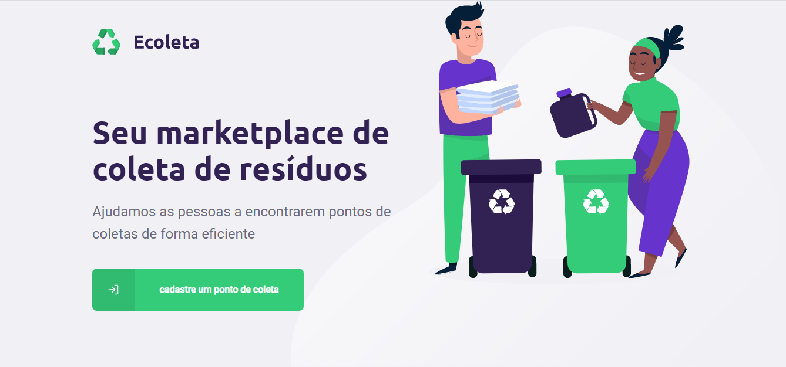
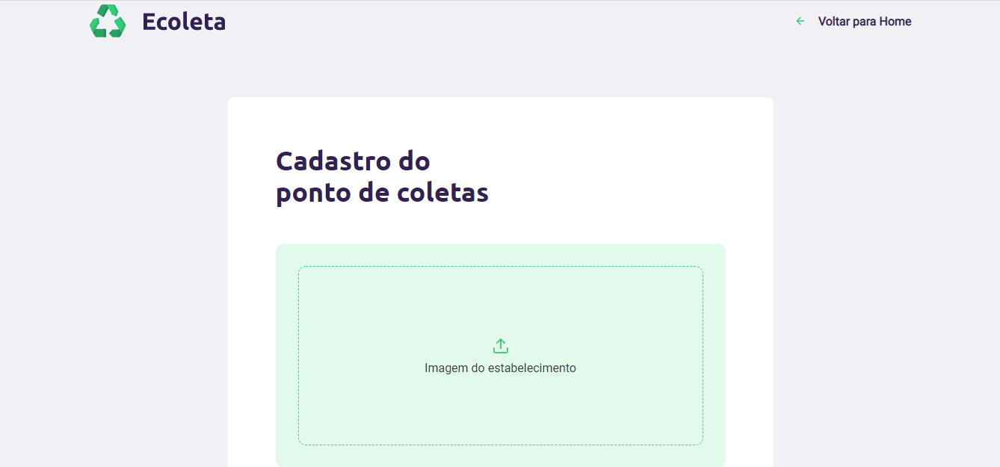
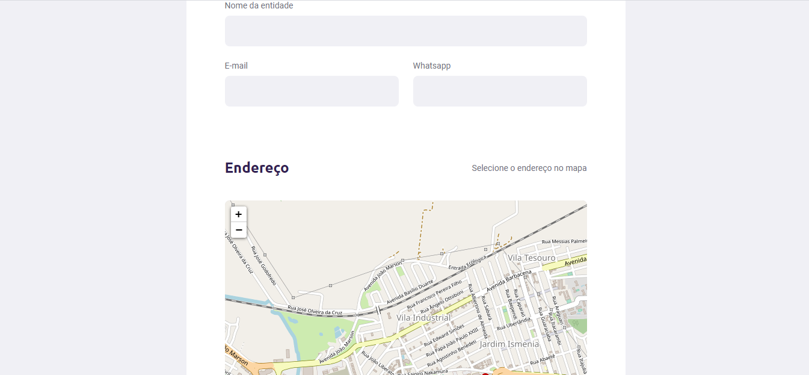

<h3>Projeto</h3>

O projeto consiste em uma aplicação desenvolvida para cadastrar ou buscar por pontos de coletas de resíduos como pilhas e baterias, lâmpadas, papéis e papelão, entre outros

<h3>Tecnologias</h3>

Segue abaixo as tecnologias utilizadas no desenvolvimento:

<ul>
  <li>Typescript</li>
  <li>Node.js</li>
  <li>React</li>
  <li>React Native</li>
  <li>Expo</li>
<ul>